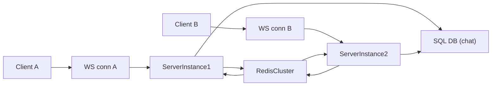

## Multi-instance presence & event sync for OpenLiveSync

### Goals & constraints

- **Goals**
  - **Horizontal scale**: Run many OpenLiveSync server instances behind a load balancer.
  - **Consistent presence**: All clients in a room see the same presence list and awareness, regardless of which instance they hit.
  - **Cross-instance event fan-out**: CRDT and custom events (`broadcast_event`) propagate to all clients across all instances.
  - **Low latency**: Sub-100ms typical end-to-end propagation under normal load.
- **Constraints / existing architecture**
  - Current server keeps **all room state in memory** (`RoomManager` + `Room` in `packages/server/src`), with **no clustering**.
  - Presence is **opaque JSON** (`Presence`) stored per connection; chat history is already backed by a configurable DB.
  - There is a **single WebSocketServer + RoomManager per process**.

### High-level architecture

Introduce a **shared coordination backend** (e.g. Redis or a similar in-memory store with pub/sub) to hold global ephemeral state and deliver cross-instance events.

- **Server instances** remain mostly stateless regarding presence and room membership beyond local connections; they rely on Redis for global view and for broadcasting.
- **Redis responsibilities**:
  - Global **presence state** per room (`room:{roomId}:presence` hashes, `room:{roomId}:members` sets).
  - **Pub/sub channels** for events and presence updates per room (`room:{roomId}:events`, `room:{roomId}:presence-updates`).
  - Optional **heartbeats/TTL** to detect crashed instances/connections.
- **Load balancer**
  - Can be simple round-robin with sticky sessions per WebSocket connection (no awareness of room IDs required) because the Redis layer guarantees cross-instance propagation.

### Data model for distributed presence

- **Global identifiers**
  - Each server instance has a unique `instanceId` (e.g. UUID or `hostname:pid`).
  - Each local `connectionId` is already generated; define a **global connection key**: `gConnId = instanceId + ":" + connectionId`.
- **Redis keys (per room)**
  - `room:{roomId}:members` → **Set of `gConnId`** active in the room.
  - `room:{roomId}:presence:{gConnId}` → **Hash/JSON** with:
    - `userId` (if authenticated)
    - `presence` (stringified opaque payload)
    - `instanceId`
    - `updatedAt` (timestamp)
  - Optional: `room:{roomId}:presence-heartbeat:{gConnId}` with low TTL for crash detection.

### Distributed presence lifecycle

- **Join room** (`MSG_JOIN_ROOM` → `Room.join`)
  - Local instance:
    - Adds connection to its in-process `Room` as today.
    - Writes to Redis:
      - `SADD room:{roomId}:members gConnId`.
      - `HSET room:{roomId}:presence:{gConnId} ...` with initial presence.
    - Reads **current global presence snapshot** by scanning `room:{roomId}:members` and `presence:*` hashes.
    - Sends `room_joined` to the joining client with this **global snapshot**, not just local members.
    - Publishes a `presence_joined` event on `room:{roomId}:presence-updates` with payload `{ gConnId, userId, presence }`.
  - Other instances:
    - Subscribe to `room:{roomId}:presence-updates`.
    - When they see `presence_joined` from another instance, they update their **in-memory presence map** and broadcast `presence_updated` (`joined`) to their own room connections.
- **Update presence** (`MSG_UPDATE_PRESENCE` → `Room.updatePresence`)
  - Local instance:
    - Retains existing **throttling** per connection.
    - Updates local in-memory presence.
    - Updates Redis `presence:{gConnId}` hash (and refresh heartbeat key if used).
    - Publishes a `presence_updated` message on `room:{roomId}:presence-updates` with `{ gConnId, userId, presence }`.
  - Other instances:
    - On `presence_updated`, update their local presence map for `gConnId`.
    - Broadcast a `presence_updated` message to their connected clients with `updated: [{ connectionId, presence, userId }]`.
    - **Mapping `gConnId` → wire `connectionId`**: either expose full `gConnId` to clients or map to a stable `remoteConnectionId` derived from `gConnId` (e.g. hash) to keep protocol clean.
- **Leave / disconnect**
  - Local instance On WebSocket close or explicit `leave_room`:
    - Removes connection from local `Room`.
    - `SREM room:{roomId}:members gConnId`.
    - Deletes `presence:{gConnId}`; optionally let heartbeat TTL handle crash recovery.
    - Publishes `presence_left` on `room:{roomId}:presence-updates` with `{ gConnId, userId }`.
  - Other instances:
    - On `presence_left`, remove from their local presence map and broadcast `presence_updated` with `left: [ ... ]`.
- **Crash detection via heartbeats**
  - For resilience to sudden process death:
    - Each instance periodically **refreshes a TTL key** `presence-heartbeat:{gConnId}`.
    - A small background worker per instance scans for `members` whose heartbeat expired and cleans their presence keys, emitting synthetic `presence_left` events.

### Cross-instance event synchronization

- **Current behavior**: `Room.broadcastEvent` sends `broadcast_event` only to local room members.
- **New behavior**
  - All **logical events** (`broadcast_event`, and possibly chat or future custom events) are published to Redis and then fanned out to all instances with subscribers for that room.
- **Pub/sub channels**
  - `room:{roomId}:events` for CRDT and custom events.
  - `room:{roomId}:chat` optional if you want separate channels, or just reuse `events` and distinguish by type.
- **Sending an event**
  - Local instance, on `MSG_BROADCAST_EVENT`:
    - Computes a message object `{ roomId, event, payload, originInstanceId, originConnId, msgId }`.
    - Publishes to `room:{roomId}:events` via Redis.
- **Receiving an event**
  - All instances subscribe to `room:*:events` (pattern subscription) or subscribe lazily when the first local connection joins a room.
  - On message:
    - If `originInstanceId === this.instanceId`, ignore (you already applied locally when publishing, or alternatively only apply on receive and skip local immediate send).
    - Look up local `Room` for `roomId`, if any.
    - Relay as `broadcast_event` to all local clients in that room.

### Server-side integration strategy

- **1. Abstract the coordination backend**
  - Introduce a `DistributedBackend` interface in `packages/server/src/distributed-backend.ts`:
    - Presence ops: `setPresence`, `removePresence`, `listPresence`, `publishPresenceUpdate`, `subscribePresence(roomId, handler)`.
    - Event ops: `publishEvent`, `subscribeEvents(roomId, handler)`.
  - Provide a **Redis implementation** (e.g. `RedisDistributedBackend`) using `ioredis` or `redis` client.
- **2. Wrap `RoomManager` in a distributed-aware facade**
  - New `DistributedRoomManager` uses the existing `RoomManager` API but:
    - Intercepts `joinRoom`, `leaveRoom`, `updatePresence`, and `broadcastEvent`.
    - Ensures all local mutations are mirrored into the `DistributedBackend`.
    - Listens to distributed events and calls into the underlying `Room` to update its **in-memory presence map** and broadcast to locally connected clients.
  - This keeps the bulk of the existing `Room` and `Connection` logic intact while layering in distributed concerns.
- **3. Bootstrapping & subscription lifecycle**
  - When the **first local connection** joins a room:
    - `DistributedRoomManager` subscribes to `presence-updates` and `events` for that room.
  - When the **last local connection** leaves a room:
    - It can unsubscribe to minimize Redis load, or keep subscriptions if the cost is negligible.
- **4. Protocol considerations**
  - To minimize protocol changes:
    - Reuse the existing `ServerMessage` types (`presence_updated`, `broadcast_event`) and do **not expose instance IDs** to clients.
    - Represent remote users using synthetic `connectionId`s that are stable per `gConnId` (e.g. `hash(gConnId)`), so clients don’t need to know which server instance hosts the connection.
  - Alternatively, if you’re willing to evolve the protocol:
    - Expose a `clientId` separate from `connectionId` that’s stable across reconnects and across instances, and key presence by `clientId` instead.

### Consistency, guarantees, and failure modes

- **Consistency model**
  - Presence and events are **eventually consistent** with very low typical lag (bounded by Redis and network latency).
  - Small windows of inconsistency are possible during process crashes or network partitions, but are mitigated by heartbeat-based cleanup.
- **Ordering guarantees**
  - Redis pub/sub preserves ordering **per channel**, so events for a given room preserve publish order.
  - Document this guarantee so CRDT and application logic can rely on it.
- **Failure modes**
  - Redis unavailable: server instances can fall back to **local-only mode** for presence and events, or reject new connections depending on your tolerance.
  - Instance crash: heartbeats + TTL ensure presence is cleaned up and `presence_left` events are eventually emitted.

### Deployment & operations

- **Infrastructure**
  - Deploy Redis (or another equivalent backend) in a **high-availability cluster**.
  - Run multiple OpenLiveSync server instances behind a load balancer (e.g. Nginx, ELB) with sticky WebSocket connections.
- **Scaling strategy**
  - Scale server instances horizontally based on CPU and memory, trusting Redis to handle cross-instance coordination.
  - If a single Redis cluster becomes a bottleneck, introduce **sharding by roomId hash** across multiple Redis clusters, with routing done in the `DistributedBackend` layer.

### Incremental rollout plan

1. **Introduce `DistributedBackend` interface** and a no-op/local implementation that mimics current single-instance behavior for easier testing.
2. **Refactor `RoomManager` → `DistributedRoomManager`** without changing the external API; wire it into `createWebSocketServer` & `createWebSocketHandler`.
3. **Implement Redis-based `DistributedBackend`** and feature-flag it via server options (e.g. `distributed: { type: 'redis', url: ... }`).
4. **Implement cross-instance presence sync** (join/update/leave) using Redis, while still keeping events local.
5. **Add cross-instance event pub/sub** for `broadcast_event` and (optionally) chat messages; verify ordering and no-duplication behavior.
6. **Add heartbeats & TTL-based cleanup** to handle crashed instances and stale presence entries.
7. **Load test** with multiple server instances and realistic client workloads; tune throttling, Redis key patterns, and subscription strategies.
8. **Harden error handling and observability** (metrics/logs for Redis latency, pub/sub backlog, and presence size per room).

